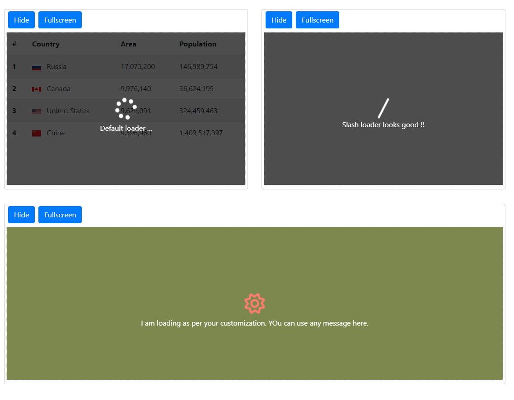

# Spinner

Simple and clean spinner component in Angular 10, Bootstrap and Font-awsome

## Development server

Run `ng serve` for a dev server. Navigate to `http://localhost:4200/`. The app will automatically reload if you change any of the source files.

## Screenshot



## Usage

Import `SpinnerModule` in in the root module(`AppModule`):

```typescript
import { NgModule } from "@angular/core";

// Import library module
import { SpinnerModule } from "./shared/spinner/spinner.module";

@NgModule({
  imports: [
    // ...
    SpinnerModule,
  ],
  schemas: [],
})
export class AppModule {}
```

Add `NgxSpinnerService` service wherever you want to use the `ngx-spinner`.

```typescript
import { NgxSpinnerService } from "ngx-spinner";

class AppComponent implements OnInit {
  constructor(private spinner: NgxSpinnerService) {}

  ngOnInit() {
    /** spinner starts on init */
    this.spinner.show();

    setTimeout(() => {
      /** spinner ends after 5 seconds */
      this.spinner.hide();
    }, 5000);
  }
}
```

Now use in your template

```html
<app-spinner></app-spinner>
```

`Settings `

```typescript
export class SpinnerSettings {
  name: string;
  bgColor?: string;
  zIndex?: number;
  textColor?: string;
  fullscreen?: boolean;
  show?: boolean;
  spinnerColor?: string;
  spinnerIcon?: string;
  spinnerSize?: "small" | "medium" | "large";
  spinnerStyle?: "regular" | "solid" | "light" | "dualtone";
}
```
